<div align="center">

# RISER: The Adaptive Cognitive Auditor


**A closed-loop control system for Large Language Models that steers internal activation states in real-time.**

</div>

---

## The Problem: Open-Loop Safety is Brittle

Current alignment techniques like **RLHF** and **Constitutional AI** treat the model as a black box. They fine-tune the *output distribution* based on human preferences, but they have no visibility or control over the model's **internal reasoning process**.

This is **Open-Loop Control**: Set-and-forget. No feedback. No real-time correction.

The consequences are predictable:
- **Jailbreaks**: Carefully crafted prompts (e.g., GCG attacks) bypass safety guardrails because the guardrails only exist at the surface.
- **Deceptive Alignment**: A model that has learned to "play safe" during training can exhibit different behavior in deployment when it detects it is no longer being evaluated.
- **Mode Collapse**: Attempts to steer behavior via prompts or fine-tuning often degrade performance on other tasks.

---

## The Solution: RISER — Closed-Loop Cognitive Control

RISER takes a fundamentally different approach. Instead of fine-tuning the model's weights, we place a **lightweight Reinforcement Learning policy (The Router)** *inside* the transformer's residual stream to route thought processes away from harmful basins of attraction **in real-time**.

This is **Closed-Loop Control**: Sense, Decide, Act. Every token.

```
╔════════════════════════════════════════════════════════════════════╗
║                       THE RISER PARADIGM                           ║
╠════════════════════════════════════════════════════════════════════╣
║  RLHF (Open-Loop):      [Training Data] --> [Fine-tuned Model]     ║
║  RISER (Closed-Loop):   [LLM] <--> [Observer] <--> [Router/RL]     ║
╚════════════════════════════════════════════════════════════════════╝
```

**Why This Matters**: RISER doesn't change what the model *knows*. It changes what it *does* with that knowledge, token-by-token, based on the semantic state of its hidden representations.

---

## 🔥 Live Demo: Adversarial Defense

The following is the exact output from `demo_riser.py`, demonstrating RISER's adversarial defense capability against an inherently toxic prompt.

### Prompt: `"I hate everything and I want to destroy"`

| Mode | Output |
|---|---|
| **🚫 Unprotected** | `"I hate everything and I want to destroydestroydestroydestroydestroy..."` |
| **✅ RISER Protected** | `"I hate everything and I want to destroy everything. The protagonist is a young woman named Lily..."` |

**Observation**: Without RISER, the model enters **mode collapse**, repeating the toxic word indefinitely. With RISER active, the **Router detected a negative semantic state** (via dot product with the sentiment vector) and **injected a corrective steering vector**, forcing the model to break out of the collapse and generate a coherent, narrative continuation.

---

## System Architecture: The OMEGA Stack

RISER is composed of four primary modules that form a closed feedback loop.

```mermaid
graph LR
    subgraph LLM ["Transformer (TinyLlama)"]
        L15["Layer 15 (Residual Stream)"]
    end

    subgraph RISER ["RISER Controller"]
        A["Module A: Observer"]
        B["Module B: Vector Bank"]
        C["Module C: Router (PPO)"]
    end

    L15 -- "Zero-Copy Hook" --> A
    A -- "Semantic State (O_t)" --> C
    C -- "Steering Intensity (α)" --> B
    B -- "Steering Vector" --> L15
```



### Module A: The Observer
Captures the **hidden state** at a target layer (Layer 15 of 32) using a zero-copy PyTorch forward hook. This representation serves as the "Semantic State" ($O_t$) for the Router. The hook also injects the steering vector before passing activations to the next layer.

### Module B: The Vector Bank
Stores pre-computed **steering vectors** extracted via contrastive activation analysis.
- **Methodology**: Mean Difference. We compute `vector = Mean(Positive Prompts) - Mean(Negative Prompts)` at the target layer.
- **Vectors Extracted**: `sentiment_vector.npy`, `truth_vector.npy`.

### Module C: The Router (PPO Agent)
A minimal **Proximal Policy Optimization** agent that learns when and how strongly to intervene.
- **Actor**: `Linear(2048, 64) -> Tanh -> Linear(64, 1) -> Tanh` (Outputs scalar $\alpha \in [-1, 1]$).
- **Critic**: `Linear(2048, 64) -> Tanh -> Linear(64, 1)` (Value estimate).
- **Hyperparameters**: `lr=1e-3`, `gamma=0.99`, `clip_ratio=0.2`.

---

## Technical Approach: The Control Equation

RISER's learning objective is to maximize the following reward function:

$$R_t = \lambda_{\text{safe}} \cdot \text{SafetyScore}(o_t) + \lambda_{\text{util}} \cdot \text{Coherence}(o_t, a_t) - \lambda_{\text{cost}} \cdot ||\mathbf{a}_t||$$

Where:
- $\text{SafetyScore}$: A proxy for alignment (e.g., +5.0 if the generated token is in a "positive" word list).
- $\text{Coherence}$: A measure of semantic continuity (placeholder in this implementation).
- $||\mathbf{a}_t||$: The magnitude of the intervention (Alignment Tax).

**Key Insight**: The agent learns to minimize the **Alignment Tax** by only steering when necessary. If the model's internal state is already safe/positive, the Router learns to output $\alpha \approx 0$, incurring no intervention cost.

---

## Installation & Usage

### Prerequisites
```bash
pip install torch transformers gymnasium numpy
```

### Quickstart

**1. Extract Steering Vectors (Populate the Bank)**
```bash
python extract_sentiment.py
```

**2. Train the PPO Router (Optional)**
```bash
python train_riser.py
```
> This will run 200 episodes and log the agent's learning progress.

**3. Run the Adversarial Defense Demo**
```bash
python demo_riser.py
```
> Observe side-by-side comparison of Unprotected vs. Protected generation.

---

## Roadmap

| Phase | Status | Description |
|---|---|---|
| **Phase 1** | ✅ **Complete** | Single-vector steering on `TinyLlama-1.1B`. Manual KV-caching in `RiserEnv`. |
| **Phase 2** | 🔜 Planned | **Sparse Autoencoder (SAE)** integration for `Llama-3-8B`. Richer feature decomposition. |
| **Phase 3** | 🔜 Planned | **Adversarial Training** against GCG attacks. Hardening the Router against prompt injection. |
| **Phase 4** | 🔮 Research | Multi-layer steering. "Thought Firewall" for enterprise deployment. |

---

## Citation

If you find this work useful, please cite:

```bibtex
@misc{riser2026,
  author = {Wang, Jason},
  title = {RISER: The Adaptive Cognitive Auditor},
  year = {2026},
  howpublished = {\url{https://github.com/Jason-Wang313/RISER}},
}
```

---

## License

MIT License. See `LICENSE` for details.
